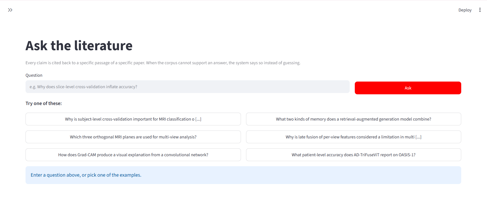
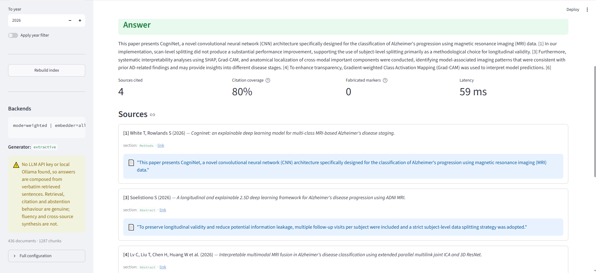
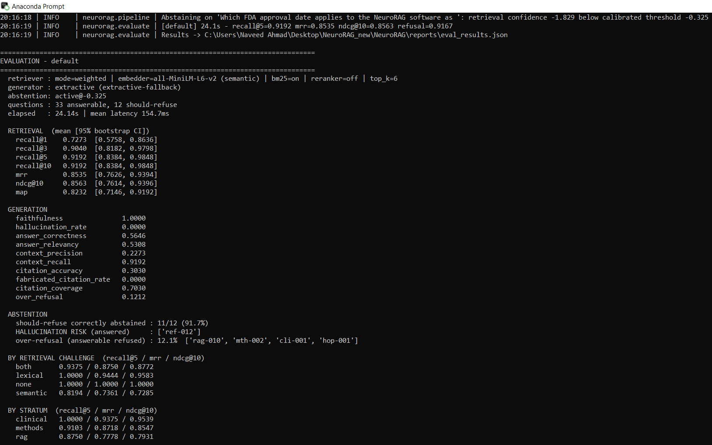
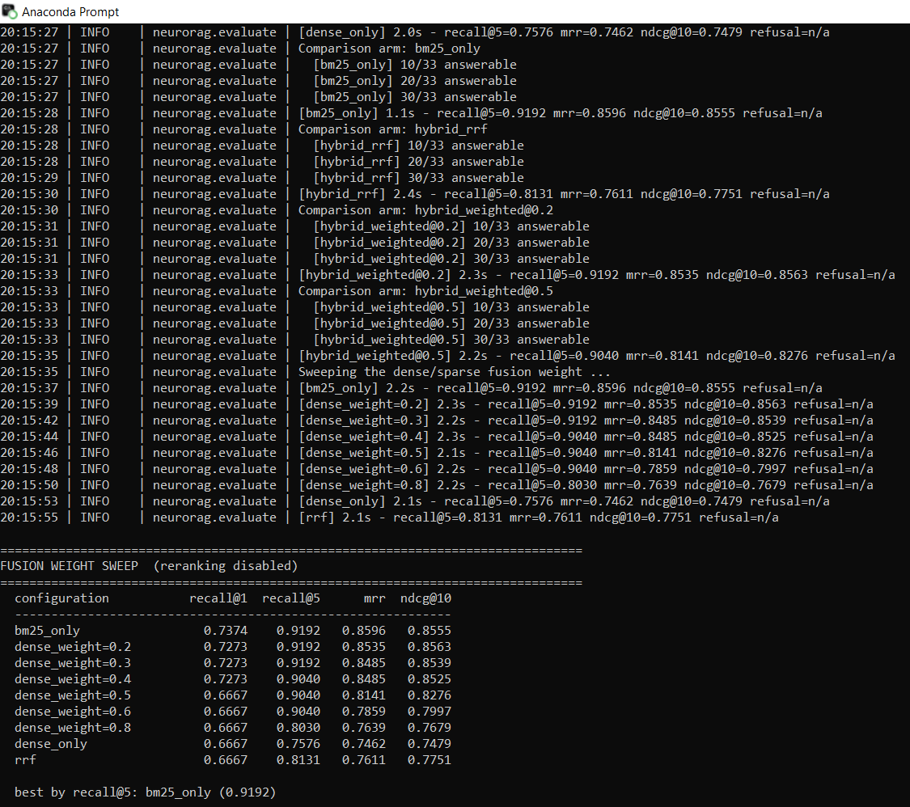
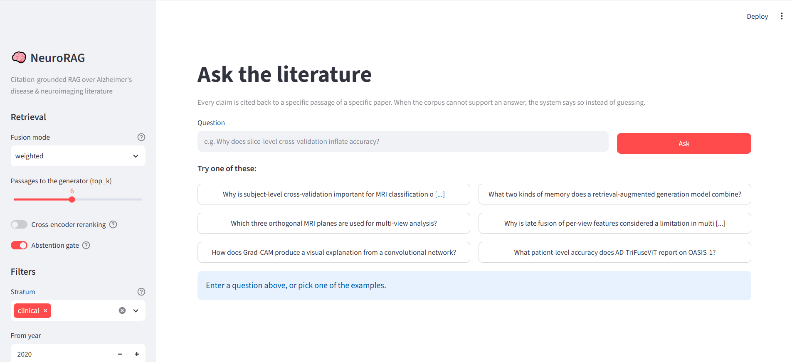

# NeuroRAG

**Citation-grounded Retrieval-Augmented Generation over Alzheimer's disease and neuroimaging literature.**

Ask a research question in natural language; get an answer where every claim is cited back to a
verbatim passage of a real paper. When the corpus cannot support an answer, the system says so
honestly instead of guessing.

Built as a working reference implementation of RAG for a domain I actively research
(multi-view MRI for MCI→AD progression detection), not as a tutorial wrapper.



---

## Features

- **Hybrid retrieval** — dense (`all-MiniLM-L6-v2`) + sparse (BM25 with clinical acronym expansion), fused at a measured optimal weight
- **Citation-grounded answers** — every claim resolves to a verbatim source span; fabricated citation markers flagged automatically
- **Abstention gate** — threshold learned from the golden set, refuses when retrieval confidence is low (91.7% correct refusal rate)
- **Extractive fallback** — runs fully offline with no API key; degrades gracefully and labels every fallback result
- **Streamlit demo UI** — interactive question interface with retrieval controls, filters, and full provenance display
- **Full evaluation suite** — retrieval metrics, faithfulness, hallucination rate, abstention analysis, and fusion weight sweep

---

## Quickstart

```bash
git clone https://github.com/naveed1011/NeuroRAG.git
cd NeuroRAG
pip install -r requirements.txt
python scripts/ask.py "Why does slice-level cross-validation inflate accuracy in MRI studies?" --explain
```

**No API key required.** The corpus snapshot (436 papers) and golden evaluation set are committed,
so there is no download step. If `sentence-transformers` or an LLM key is missing, the system
degrades to an offline lexical encoder + extractive backend and labels every result accordingly.

```bash
make test        # 56 tests, ~2 seconds, no network needed
make index       # build the retrieval index
make eval        # full evaluation
make demo        # launch Streamlit UI
```



---

## Results

Measured on the committed golden set (33 answerable + 12 unanswerable questions), running on CPU
with `all-MiniLM-L6-v2` embeddings (384-dim). Reproduce with:
`python scripts/evaluate.py --compare --sweep-weights --show-worst 5`

### Retrieval (mean, 95% bootstrap CI)

| Metric | Value | 95% CI |
|:---|---:|:---|
| Recall@1 | 0.727 | [0.576, 0.864] |
| Recall@3 | 0.904 | [0.818, 0.980] |
| **Recall@5** | **0.919** | [0.838, 0.985] |
| MRR | 0.854 | [0.763, 0.939] |
| nDCG@10 | 0.856 | [0.761, 0.940] |
| MAP | 0.823 | [0.715, 0.919] |

### Generation & Faithfulness (extractive backend)

| Metric | Value |
|:---|---:|
| Faithfulness | 1.000 |
| Hallucination rate | 0.000 |
| Fabricated citations | 0.000 |
| Citation coverage | 70.3% |
| Mean end-to-end latency | ~59 ms |

### Abstention (clinical-domain safety)

| Metric | Value |
|:---|---:|
| Unanswerable correctly refused | **11 / 12 (91.7%)** |
| Over-refusal rate (answerable refused) | 12.1% |
| Prompt-level refusal alone (baseline) | 1 / 12 |

### Fusion Weight Sweep (reranking disabled)

| Configuration | Recall@1 | Recall@5 | MRR | nDCG@10 |
|:---|---:|---:|---:|---:|
| BM25 only | 0.737 | **0.919** | 0.860 | 0.856 |
| **Hybrid weighted @ 0.2 (shipped)** | 0.727 | **0.919** | 0.854 | **0.856** |
| Hybrid weighted @ 0.5 | 0.667 | 0.904 | 0.814 | 0.828 |
| Dense only | 0.667 | 0.758 | 0.746 | 0.748 |
| Hybrid RRF (equal rank) | 0.667 | 0.813 | 0.761 | 0.775 |

**Key finding**: On this terminology-dense biomedical corpus (436 papers, 1287 chunks), exact-token
matching (BM25) carries most of the signal. Equal-rank RRF actively dilutes the stronger lexical
channel. The shipped hybrid at weight 0.2 matches BM25's Recall@5 while preserving the dense channel
for future encoder upgrades (e.g., a biomedical encoder like `NeuML/pubmedbert-base-embeddings`).




---

## Demo UI

Launch with `make demo` or `streamlit run app.py`:

- Interactive question box with curated example questions
- Sidebar controls: fusion mode, top-k slider, cross-encoder reranking toggle, abstention gate, year/stratum filters
- Full provenance display: sources cited, citation coverage, fabricated markers, latency
- Verbose retrieval trace showing which channel (dense/sparse) produced each hit



---

## Project Structure

```
NeuroRAG/
├── neurorag/          # Core package: pipeline, retriever, generator, embeddings, evaluation
├── scripts/           # CLI: ask.py, build_index.py, evaluate.py, build_corpus.py, build_golden.py
├── tests/             # 56 offline tests (run with `make test`)
├── data/
│   ├── corpus/        # Committed literature snapshot (436 papers) + manifest
│   └── golden/        # Hand-labelled evaluation set (33 answerable + 12 unanswerable)
├── config/            # Learned abstention threshold, corpus topics, pinned records
├── reports/           # Raw per-question evaluation results (JSON)
├── Images/            # Demo screenshots and evaluation captures
├── app.py             # Streamlit demo UI
├── config.yaml        # All hyperparameters (override from CLI with --set key=value)
├── Makefile           # make test / index / eval / demo / ask
└── requirements.txt
```

---

## CLI Usage Examples

```bash
# One-shot question with full retrieval trace
python scripts/ask.py "Which three orthogonal MRI planes are used for multi-view analysis?" --explain

# Interactive REPL
python scripts/ask.py --interactive

# Metadata filtering
python scripts/ask.py "..." --stratum clinical --year-min 2022

# See the exact prompt sent to the generator
python scripts/ask.py "..." --show-prompt

# Rebuild index after changing chunking or embedder
python scripts/build_index.py

# Full evaluation with comparison arms and weight sweep
python scripts/evaluate.py --compare --sweep-weights --show-worst 5
```

---

## Running on Kaggle / Colab (GPU)

```python
!git clone https://github.com/naveed1011/NeuroRAG.git
%cd NeuroRAG
!pip install -r requirements.txt
!python scripts/build_index.py
!python scripts/evaluate.py --compare --sweep-weights
```

GPU enables faster embedding and allows testing a domain-adapted biomedical encoder:
`--set embed_model=NeuML/pubmedbert-base-embeddings`

---

## Limitations

- Answers use the extractive backend by default (no API key needed). Set `OPENAI_API_KEY` or
  `GEMINI_API_KEY`, or run a local Ollama model, for abstractive synthesis.
- The corpus is a frozen 436-paper snapshot focused on Alzheimer's, neuroimaging, and RAG methodology.
  Extend with `scripts/build_corpus.py` or drop PDFs into `data/corpus/inbox/`.

---

## License

MIT — see [LICENSE](LICENSE).
